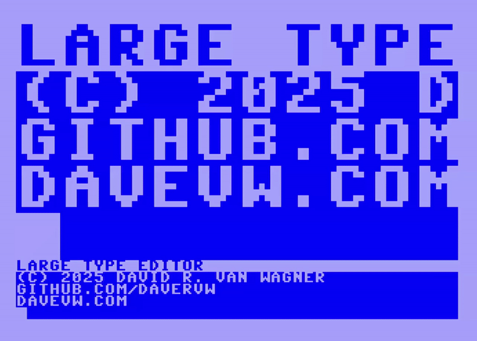

# Large Type Editor for C64 #

Large Type Editor is a utility to display a portion of the C64 screen enlarged, with a view of the currently displayed lines in normal size.  PETSCII graphic block characters are used to draw a character's 8x8 pixels in a 4x4 character grid.  The VICII screen is now at $CC00 while the virtual screen is still at $0400.  The IRQ interrupt is captured to check for video changes and paint them at $CC00.  Chargen ROM had to be copied to same address $D000-$DFFF RAM, and encoded 4x4 characters are using $E000-$FFFF RAM.  

Limitations:

* Code and buffers are using $C000-$CF00.
* Unfortunately color support is not currently implemented (more complex challenge as source and destination addresses will both be $D800).
* Current implementation has a fixed viewport onto the virtual screen.  Only the top 5 lines, leftmost 10 columns are currently displayed.

Press STOP+RESTORE to recover to normal operation.

